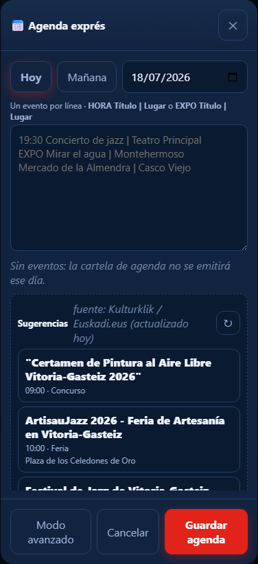

# Agenda del día

1. Toca **Agenda del día**.
2. Elige **Hoy**, **Mañana** o una fecha.
3. Escribe un evento por línea:
   - `19:30 Concierto de jazz | Teatro Principal`
   - `EXPO Mirar el agua | Montehermoso`
4. También puedes tocar una sugerencia de Kulturklik para añadirla.
5. Toca **Guardar agenda**.

Usa `EXPO` en exposiciones sin hora. Cada evento saldrá como una escena propia,
con hora o `EXPO`, título y lugar en tamaño grande.

Si no hay eventos, la cartela de Agenda no se emite ese día. **Modo avanzado**
solo hace falta para programaciones excepcionales.
