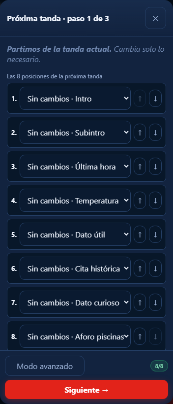

# Preparar la próxima tanda

1. Toca **Preparar próxima tanda**.
2. Verás las ocho posiciones actuales. Déjalas en **Sin cambios** salvo las que
   quieras sustituir.
3. Puedes reordenarlas con `↑` y `↓`.
4. Toca **Siguiente** y configura únicamente las posiciones modificadas.
5. Revisa el resumen y confirma.

Cerrar no borra el trabajo: al volver, el borrador se recupera. Si una elección
era errónea, puedes volver al paso anterior y cambiar cualquier posición.

Los carruseles muestran qué pieza está en uso y cuál vendrá después. Los datos
automáticos indican su origen y última comprobación en **Estado**.
