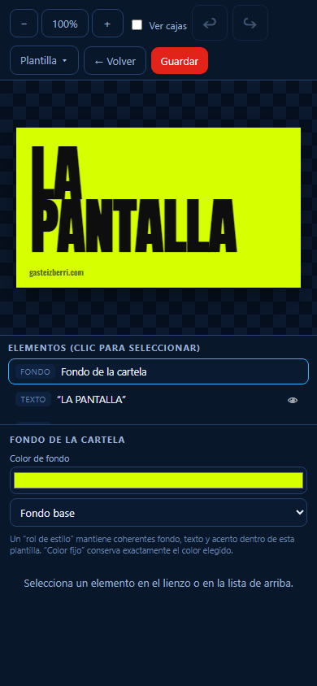

# Retocar el estilo de una cartela

1. En la cartela, toca el botón de diseño `🎨`.
2. Toca un elemento en el lienzo o en la lista **Elementos**.
3. Mueve o redimensiona con el dedo. Los controles inferiores cambian según el
   elemento seleccionado.
4. Toca **Guardar**.

En vertical, el lienzo está arriba y los controles debajo. En horizontal se
colocan lado a lado. `↩` y `↪` deshacen y rehacen.

**Usar como plantilla** aplica esa composición a futuras cartelas del mismo
tipo. **Guardar como plantilla nueva** crea una variante propia marcada con ★.
