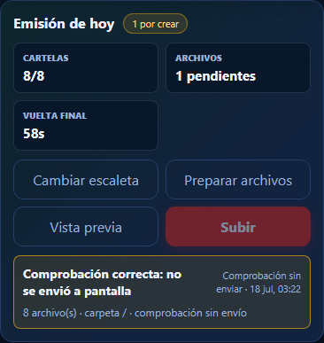

# Preparar, revisar y subir

1. Comprueba que aparecen **8/8 cartelas**.
2. Toca **Preparar archivos**. Los vídeos sin cambios se reutilizan; los demás
   muestran el progreso mientras se generan.
3. Toca **Vista previa** para revisar la vuelta completa.
4. Cuando estés conforme, toca **Subir** y confirma.

**Comprobación correcta: no se envió a pantalla** significa que todo se validó,
pero la emisión real no cambió. Un envío verdadero aparece expresamente como
pantalla actualizada y queda registrado con fecha y hora.

Si falla una posición o no hay exactamente ocho MP4, el envío se detiene y la
pantalla conserva la última tanda válida.
